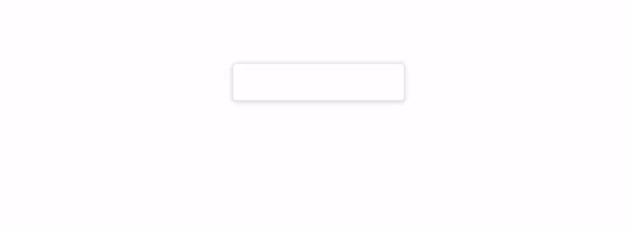
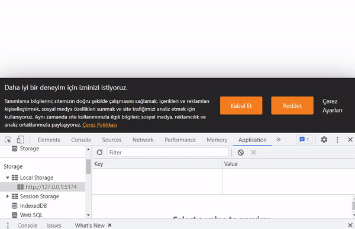
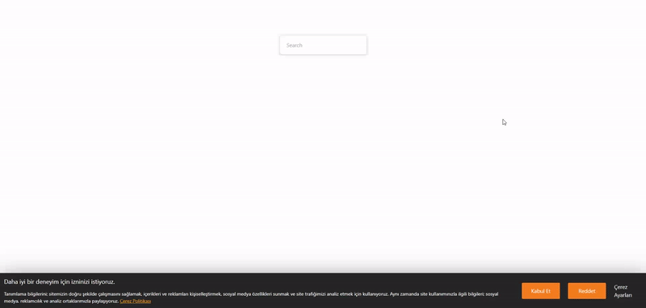
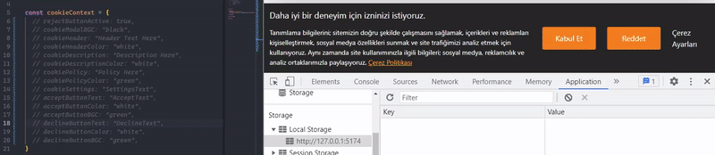
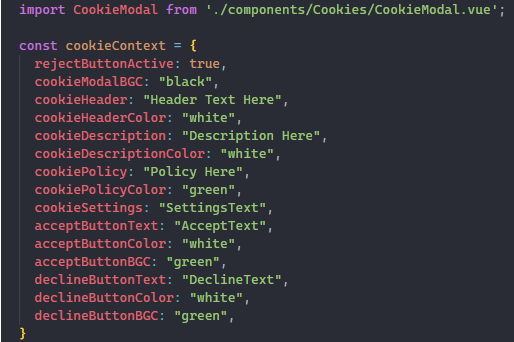
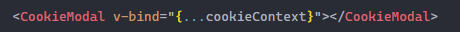
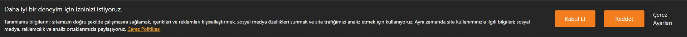

# Autocomplete Search Project

This is a autocomplete search bar project. Data is given by the user.



## Datas
You can customize the data.

```bash
const data = [
	"Hasan",
	"Hüseyin",
	"Ali",
	"Veli",
	"Fatih",
	"Fatih Tarım",
	"Fatih Tufan",
	"Alihan",
	"Ankara",
	"Rize",
	"Adıyaman",
	"Trabzon",
];
```

# Cookie Modal Project

This is a cookie modal project and it is customizable. Accept or Decline is saved into local storage. You can see the full list of configurations below.

This is the default settings for modal.


These are the policy and cookie settings modal.


You can customize the default settings.


## First install all dependencies

- npm install

## Instructions
- Props

<!--  -->

```bash
import CookieModal from './components/Cookies/CookieModal.vue';

const cookieContext = {
	rejectButtonActive: true,
	cookieModalBGC: "black",
	cookieHeader: "Header Text Here",
	cookieHeaderColor: "white",
	cookieDescription: "Description Here",
	cookieDescriptionColor: "white",
	cookiePolicy: "Policy Here",
	cookiePolicyColor: "green",
	cookieSettings: "SettingsText",
	acceptButtonText: "AcceptText",
	acceptButtonColor: "white",
	acceptButtonBGC: "green",
	declineButtonText: "DeclineText",
	declineButtonColor: "white",
	declineButtonBGC: "green",
	cookieSettingsTitle: "Title Here",
	cookieSettings_1: "Setting1",
	cookieSettings_2: "Setting2",
	cookieSettings_3: "Setting3",
	cookieSettings_4: "Setting4",
	cookiePolicyTitle: "Çerez Politikası",
	cookiePolicyText: "Biz, Şirket Adı, olarak güvenliğinize önem veriyor ve bu Çerez Politikası ile siz sevgili ziyaretçilerimizi, web sitemizde hangi çerezleri, hangi amaçla kullandığımız ve çerez ayarlarınızı nasıl değiştireceğiniz konularında kısaca bilgilendirmeyi hedefliyoruz. ",
}
```

- Sending component and prop



- Fully customazible cookie modal



## Customizable Options

| Props                  | Type    | Description                                            | Default Value               |
|------------------------|---------|--------------------------------------------------------|-----------------------------|
| rejectButtonActive     | boolean | You can customize the reject button active or not.     | true                        |
| cookieModalBGC         | string  | You can customize the background color of the modal.   | "rgb(38,38,38)"             |
| cookieHeader           | string  | You can customize the Header text.                     | "Daha iyi bir...."          |
| cookieHeaderColor      | string  | You can customize the Header text color.               | "white"                     |
| cookieDescription      | string  | You can customize the description text.                | "Tanımlama bilgilerini...." |
| cookieDescriptionColor | string  | You can customize the description text color.          | "white"                     |
| cookiePolicy           | string  | You can customize the cookie policy text.              | "Çerez Politikası"          |
| cookiePolicyColor      | string  | You can customize the cookie policy text color.        | "orange"                    |
| cookieSettings         | string  | You can customize the cookie settings text.            | "Çerez Ayarları"            |
| acceptButtonText       | string  | You can customize the accept button text.              | "Kabul Et"                  |
| acceptButtonColor      | string  | You can customize the accept button text color.        | "white"                     |
| acceptButtonBGC        | string  | You can customize the accept button background color.  | "rgb(255,128,0)"            |
| declineButtonText      | string  | You can customize the decline button text.             | "Reddet"                    |
| declineButtonColor     | string  | You can customize the decline button text color.       | "white"                     |
| declineButtonBGC       | string  | You can customize the decline button background color. | "rgb(255,128,0)"            |
| cookieSettingsTitle    | string  | You can customize the cookie settings title text. 			| "Çerez Ayarları"            |
| cookieSettings_1       | string  | You can customize the cookie settings1 text. 					| "Zorunlu Çerezler"          |
| cookieSettings_2       | string  | You can customize the cookie settings2 text. 					| "Performans Çerezleri"      |
| cookieSettings_3       | string  | You can customize the cookie settings3 text. 					| "Hedefleme Çerezleri"       |
| cookieSettings_4       | string  | You can customize the cookie settings4 text. 					| "İşlevsellik Çerezleri"     |
| cookiePolicyTitle      | string  | You can customize the cookie policy title. 						| "Çerez Politikası"     			|
| cookiePolicyText       | string  | You can customize the cookie policy title text. 				| "Biz, Şirket Adı...."     	|

